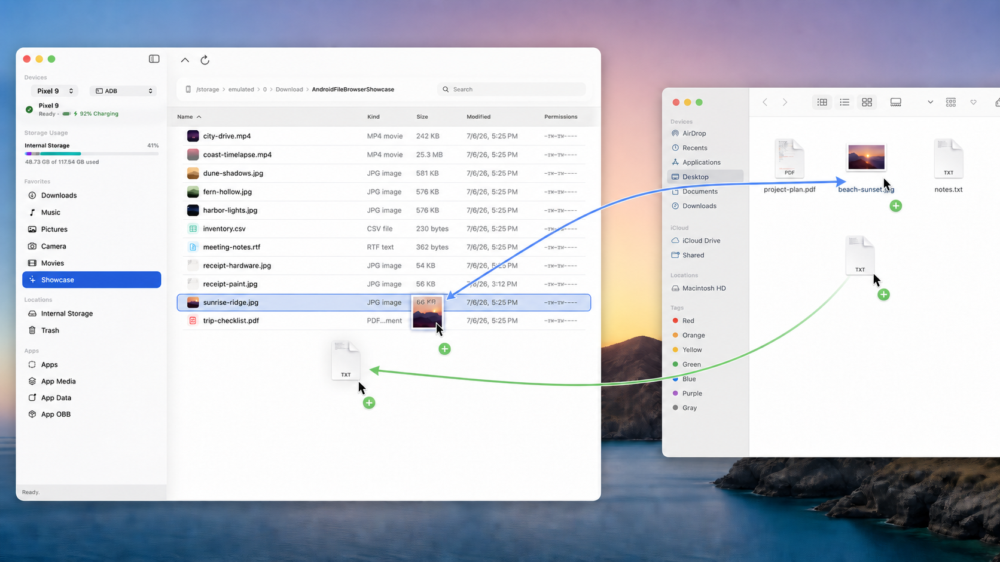
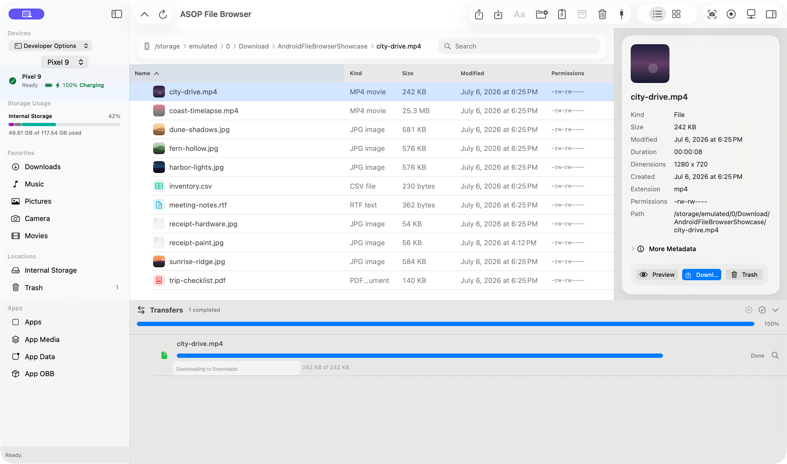
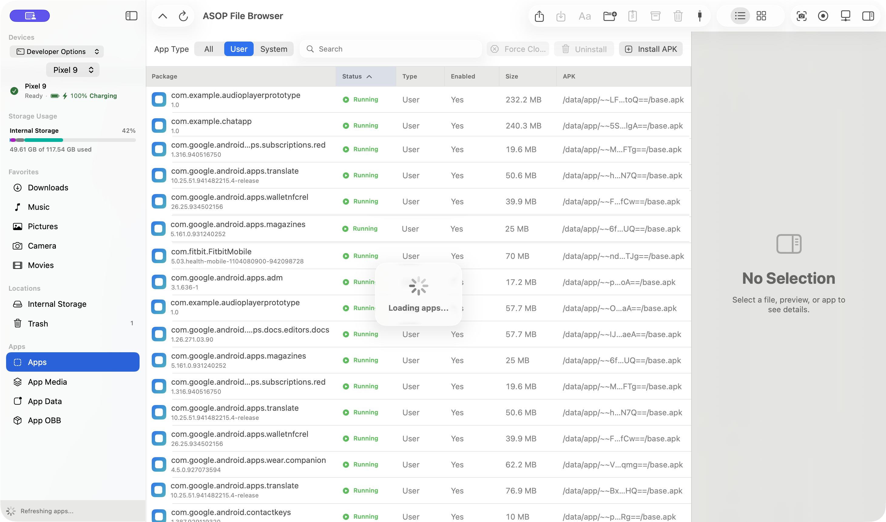
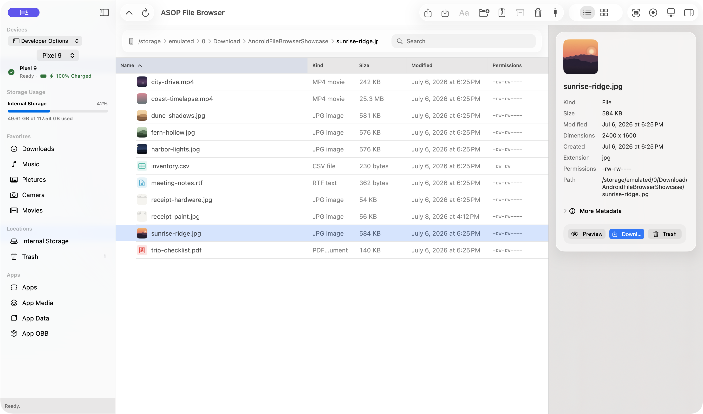
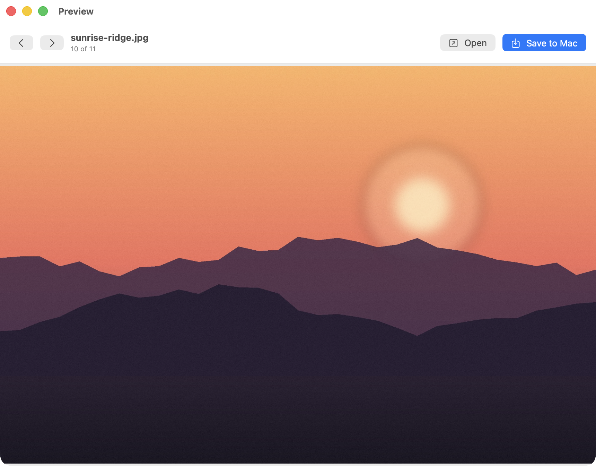
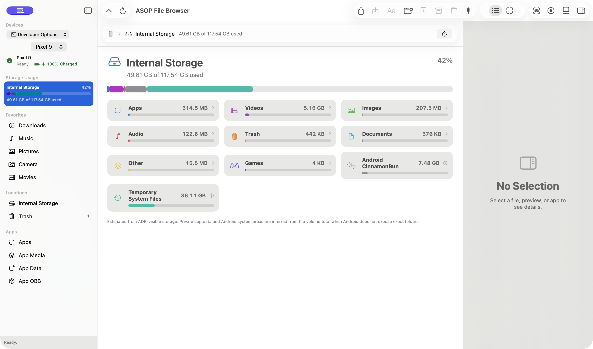

# ASOP File Browser

Browse, preview, and move files between your Android phone and Mac.

Requires macOS 15 or later.

## Screenshots


**View and edit your Android storage just like in Finder.**


**See what is taking up space using the detailed storage screen.**


**Install and download apps using the app manager.**

## Quick links

- [Setup](https://ababilinski.github.io/asop-file-browser/connect/) — Choose a connection and follow the steps.
- [Features](FEATURES.md) — See what the app can do in each connection mode.
- [Troubleshooting](https://ababilinski.github.io/asop-file-browser/faq/#troubleshooting-title) — Fix common connection and transfer problems.
- [FAQ](https://ababilinski.github.io/asop-file-browser/faq/) — Read answers to common questions.
- [Phone Tools](https://ababilinski.github.io/asop-file-browser/phone-tools/) — Learn about screenshots, recording, phone control, and app management.
- [Releases](https://github.com/ababilinski/asop-file-browser/releases) — Download the app.
- [Changelog](CHANGELOG.md) — See what changed in each version.
- [Privacy](https://ababilinski.github.io/asop-file-browser/privacy/) — See what stays on your Mac and phone.
- [Third-Party Notices](THIRD_PARTY_NOTICES.md) — Review third-party software and licenses.
- [Build from source](#build-from-source) — Build and run the project locally.
- [Release process](RELEASING.md) — Prepare and publish a release.

## What it does

- Browse Downloads, photos, videos, music, SD cards and other folders.
- Drag files between the app and Finder.
- Copy files and folders in either direction.
- Preview files before saving them.
- Track, cancel, and retry transfers.
- Choose what happens when a name already exists.
- Copy files between two connected phones.

USB or Wi-Fi debugging also adds Search Everywhere, Trash, detailed storage view and app tools like screenshots, recording, and phone control.

## Drag and drop

Drag files between ASOP File Browser and Finder.



## Transfers

See progress, cancel a transfer, or retry one that failed.



## Connections

Choose **File Transfer Mode** for everyday transfers. Choose **Developer Options** for Phone Tools and Wi-Fi.

| | File Transfer Mode | Developer Options |
| --- | --- | --- |
| Browse, preview, upload, and download | Yes | Yes |
| Wi-Fi | No | Yes |
| Phone tools (Screenshot, Record, Control) | No | Yes |

For File Transfer Mode, unlock the phone, choose **File transfer / Android Auto**, then scan the phone in the Mac app.

For Developer Options, connect with USB debugging or pair over Wi-Fi. Wi-Fi pairing uses the QR code shown on your Mac.

[File Transfer Mode steps](https://ababilinski.github.io/asop-file-browser/connect/#file-transfer) · [Developer Options steps](https://ababilinski.github.io/asop-file-browser/connect/#developer-options)

## Phone Tools

With Developer Options and USB or Wi-Fi debugging, you can:

- Search everywhere instead of just the current folder.
- See a detailed breakdown of your device storage.
- Drag APK, XAPK, APKS, and split ZIP packages from Finder to install them. Dropping several APKs opens an editable install queue in the Progress panel, with per-app errors for downgrade and signature conflicts.
- Remove, open, stop, or clear apps.
- Capture one display or combine multiple displays side by side in one screenshot or recording.
- Open more than one connected device at a time. Each device gets its own screen and control bar.

[See all Phone Tools](https://ababilinski.github.io/asop-file-browser/phone-tools/)

## App views



### Browse files



### Preview files



### Check storage



## Privacy

Files move directly between your phone and Mac. No account is needed.

[Read the Privacy Policy](https://ababilinski.github.io/asop-file-browser/privacy/)

## Install

Download the universal Mac build from [Releases](https://github.com/ababilinski/asop-file-browser/releases). It runs on Apple silicon and Intel Macs. Smaller downloads for each processor are available on the same page.

You can also build the app from source.

## Build from source

The project uses SwiftPM and Swift 6.2.

```sh
swift build
swift test
swift run AndroidFileBrowser
```

Create a local `.app` bundle with:

```sh
./scripts/package-app.sh
```

See [tool setup](TOOLS.md). Release builds are covered in the
[release process](RELEASING.md).

## Credits

File Transfer Mode uses [MTPKit 0.1.4](https://github.com/5j54d93/MTPKit/tree/0.1.4), an MIT-licensed Swift library by Ricky Chuang.

Read about [Managed Copy and tool setup](TOOLS.md), or see the complete [Third-party notices](THIRD_PARTY_NOTICES.md).

## Website

The GitHub Pages site lives in [`docs/`](docs/).

[Terms of Service](https://ababilinski.github.io/asop-file-browser/terms/) · [Privacy Policy](https://ababilinski.github.io/asop-file-browser/privacy/) · [Third-Party Notices](THIRD_PARTY_NOTICES.md)

## License

[GNU General Public License v3](LICENSE)
